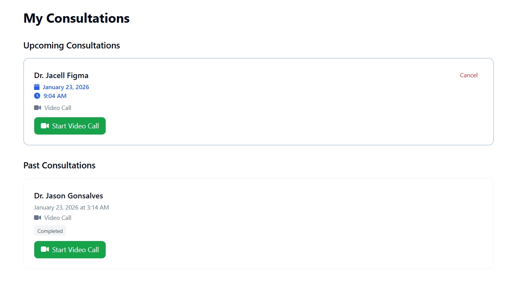
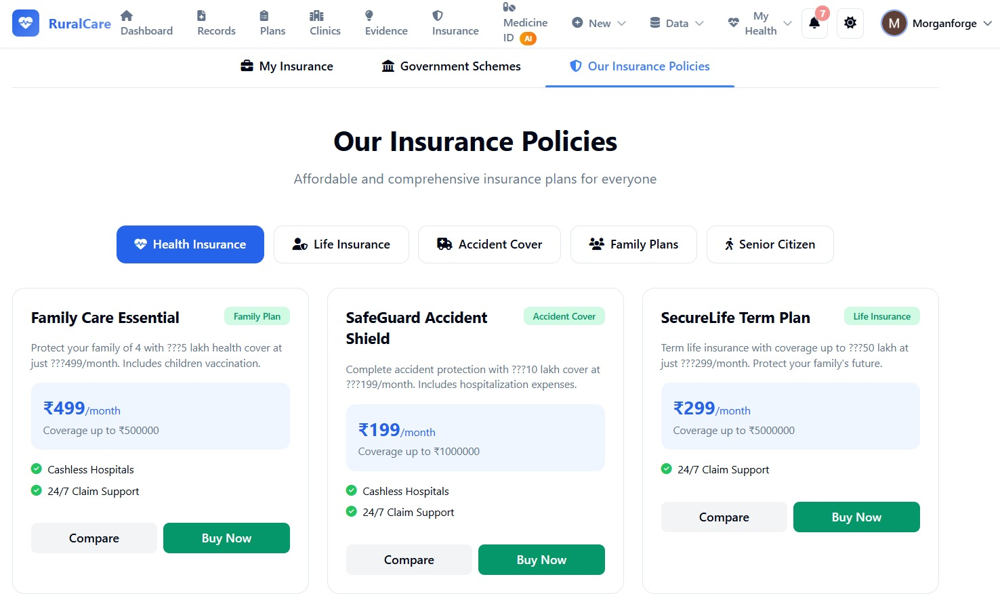

# 🏥 RuralCare - AI-Powered Healthcare Platform for Rural Communities

<div align="center">


[](https://ruralcare-kwvq.onrender.com/)
[](https://python.org)
[](https://djangoproject.com)
[](https://ethereum.org)
[](https://groq.com)

**Bridging the Healthcare Gap for Rural India with AI, Blockchain & Telemedicine**

[🚀 Live Demo](https://ruralcare-kwvq.onrender.com/) • [📖 Documentation](#-documentation) • [🛠️ Installation](#️-installation) • [🤝 Contributing](#-contributing)

</div>

---

## 📋 Table of Contents

- [🌟 Overview](#-overview)
- [✨ Key Features](#-key-features)
- [🖼️ Screenshots](#️-screenshots)
- [🏗️ Architecture](#️-architecture)
- [🛠️ Tech Stack](#️-tech-stack)
- [📦 Installation](#-installation)
- [⚙️ Configuration](#️-configuration)
- [🚀 Deployment](#-deployment)
- [📖 API Documentation](#-api-documentation)
- [🔐 Security Features](#-security-features)
- [🤝 Contributing](#-contributing)
- [📄 License](#-license)

---

## 🌟 Overview

**RuralCare** is a comprehensive AI-powered healthcare platform specifically designed to address the unique challenges faced by rural communities in accessing quality healthcare. The platform combines cutting-edge technologies including **Artificial Intelligence**, **Blockchain**, and **Telemedicine** to create an accessible, secure, and intelligent healthcare ecosystem.

### 🎯 Mission

To democratize healthcare access for rural populations by leveraging technology to:
- Enable early cancer detection through AI-powered image analysis
- Provide 24/7 AI medical assistance via voice and chat
- Connect patients with verified doctors through telemedicine
- Ensure data integrity and privacy using blockchain technology
- Simplify access to government health schemes and insurance

### 🌍 Problem Statement

Rural India faces critical healthcare challenges:
- **Doctor Shortage**: Only 1 doctor per 10,000+ population in rural areas
- **Limited Diagnostics**: Lack of specialized diagnostic facilities
- **Access Barriers**: Long distances to nearest hospitals
- **Information Gap**: Limited awareness of government health schemes
- **Affordability**: High costs of specialized treatments

### 💡 Our Solution

RuralCare addresses these challenges through:
- **AI-Powered Diagnostics**: Cancer detection, medicine identification
- **Telemedicine**: Video/audio consultations with verified doctors
- **Blockchain Security**: Immutable medical records and prescription verification
- **Offline Support**: Works in low-connectivity areas
- **Voice Assistant**: Multi-lingual AI medical guidance
- **Scheme Discovery**: Easy access to government health schemes

---

## ✨ Key Features

### 🔬 AI-Powered Cancer Detection

.jpeg)

- **Multi-Modal Analysis**: Supports X-ray, CT scan, MRI, mammography, and histopathology images
- **YOLOv8 Integration**: State-of-the-art object detection for tumor identification
- **OpenCV Processing**: Advanced image preprocessing and enhancement
- **Confidence Scoring**: AI confidence levels with explainable results
- **Personalized Treatment Plans**: AI-generated treatment recommendations based on analysis

### 💊 Medicine Identifier


- **Image-Based Recognition**: Upload pill/medicine photos for instant identification
- **Groq LLM Analysis**: Advanced AI analysis of medicine characteristics
- **Detailed Information**: Dosage, side effects, interactions, and usage guidelines
- **Safety Alerts**: Drug interaction warnings and allergy notifications
- **Patient-Only Access**: Secure access restricted to verified patients

### 📍 Nearby Clinics & Emergency Services


- **GPS-Based Discovery**: Find nearest healthcare facilities
- **Real-Time Availability**: Doctor availability and wait times
- **Emergency Services**: Quick access to ambulance and emergency contacts
- **Directions Integration**: Navigate to clinics with map integration
- **Ratings & Reviews**: Community feedback on healthcare providers

### 📋 Patient Dashboard & Health Records


- **Comprehensive Overview**: View all health metrics at a glance
- **Treatment History**: Complete record of consultations and treatments
- **Symptom Tracking**: Log and monitor symptoms over time
- **Medication Reminders**: Never miss a dose with smart reminders
- **Health Analytics**: Visual insights into health trends

### 📊 Symptom Logs & Monitoring


- **Daily Symptom Logging**: Track symptoms with severity ratings
- **Pain Scale Recording**: Standardized pain assessment
- **Mood Tracking**: Mental health monitoring
- **Photo Documentation**: Attach images to symptom entries
- **Doctor Alerts**: Automatic notifications for concerning patterns

### 🔗 Blockchain-Based Patient QR Code System


- **Unique Patient Identification**: Secure, encrypted QR codes for each patient
- **Ethereum Smart Contracts**: Immutable access logs on Sepolia testnet
- **Doctor Verification**: Only verified doctors can scan patient QR codes
- **Audit Trail**: Complete history of who accessed patient records
- **Privacy Protection**: Patients control who can view their data

### 🩺 Doctor Consultations & Telemedicine



- **Video Consultations**: HD video calls powered by Agora SDK
- **Audio Consultations**: Voice-only option for low bandwidth areas
- **Appointment Booking**: Schedule consultations with available doctors
- **Digital Prescriptions**: Blockchain-verified prescription generation
- **Follow-up Management**: Track and manage follow-up appointments

### 📅 Book Counseling Sessions


- **Mental Health Support**: Access to counselors and psychiatrists
- **Flexible Scheduling**: Book sessions at convenient times
- **Session Types**: Individual, group, and family counseling
- **Progress Tracking**: Monitor mental health journey
- **Confidential Sessions**: End-to-end encrypted conversations

### 🏥 Treatment Plans & AI Recommendations


- **Personalized Plans**: AI-generated treatment protocols
- **Evidence-Based Recommendations**: Backed by medical literature
- **Drug Interaction Checks**: Automatic safety verification
- **Side Effect Predictions**: Anticipate and manage treatment effects
- **Progress Milestones**: Track treatment journey

### 🔔 Real-Time Alerts & Notifications


- **Critical Alerts**: Immediate notifications for urgent situations
- **Medication Reminders**: Timely dosage notifications
- **Appointment Reminders**: Never miss a scheduled consultation
- **Health Tips**: Personalized wellness recommendations
- **Emergency Broadcasts**: Public health notifications

### 📚 Clinical Evidence & Research


- **Evidence Traceability**: Track sources for all AI recommendations
- **Medical Literature**: Access to relevant research papers
- **Rule-Based References**: NCCN, ASCO guidelines integration
- **Transparency**: Understand the "why" behind recommendations
- **Doctor Verification**: Expert validation of AI suggestions

### 🛡️ Insurance & Government Schemes



- **Scheme Discovery**: Find eligible government health schemes
- **Ayushman Bharat Integration**: Check PMJAY eligibility
- **Private Insurance**: Compare and apply for health policies
- **Document Upload**: Easy KYC and claim documentation
- **Application Tracking**: Monitor application status
- **Razorpay Integration**: Secure premium payments

---

## 🖼️ Screenshots

<div align="center">

| Feature | Screenshot |
|---------|------------|
| **Patient Dashboard** |  |
| **Cancer Detection** | .jpeg) |
| **Medicine Identifier** |  |
| **Consultations** |  |
| **Treatment Plans** |  |
| **Blockchain QR** |  |
| **Nearby Clinics** |  |
| **Insurance** |  |

</div>

---

## 🏗️ Architecture

```
┌─────────────────────────────────────────────────────────────────────────┐
│                           RuralCare Architecture                        │
├─────────────────────────────────────────────────────────────────────────┤
│                                                                         │
│  ┌─────────────┐    ┌─────────────┐    ┌─────────────┐                 │
│  │   Patient   │    │   Doctor    │    │    Admin    │                 │
│  │   Portal    │    │   Portal    │    │   Portal    │                 │
│  └──────┬──────┘    └──────┬──────┘    └──────┬──────┘                 │
│         │                  │                  │                         │
│         └──────────────────┼──────────────────┘                         │
│                            │                                            │
│                    ┌───────▼───────┐                                    │
│                    │    Django     │                                    │
│                    │  Web Server   │                                    │
│                    └───────┬───────┘                                    │
│                            │                                            │
│    ┌───────────────────────┼───────────────────────┐                    │
│    │                       │                       │                    │
│    ▼                       ▼                       ▼                    │
│ ┌──────────┐        ┌──────────┐           ┌──────────┐                │
│ │   AI/ML  │        │ Blockchain│           │ Database │                │
│ │ Services │        │ Services  │           │ Services │                │
│ └────┬─────┘        └────┬─────┘           └────┬─────┘                │
│      │                   │                      │                       │
│ ┌────┴────┐         ┌────┴────┐           ┌────┴────┐                  │
│ │ • YOLOv8│         │•Ethereum│           │•Supabase│                  │
│ │ • Groq  │         │ Sepolia │           │•PostgreS│                  │
│ │ • OpenCV│         │•Web3.py │           │•SQLite  │                  │
│ │ •Transfm│         │         │           │         │                  │
│ └─────────┘         └─────────┘           └─────────┘                  │
│                                                                         │
│    ┌─────────────────────────────────────────────────────┐             │
│    │              External Integrations                   │             │
│    ├─────────────┬─────────────┬─────────────┬──────────┤             │
│    │   Agora     │  Razorpay   │   Supabase  │  Groq    │             │
│    │ Video/Audio │  Payments   │   Storage   │  LLM API │             │
│    └─────────────┴─────────────┴─────────────┴──────────┘             │
│                                                                         │
└─────────────────────────────────────────────────────────────────────────┘
```

### 📁 Project Structure

```
Hospital/
├── 📁 authentication/          # User auth, QR codes, voice assistant
│   ├── models.py              # User, Patient, Doctor, QR models
│   ├── views.py               # Auth views, dashboards
│   ├── qr_views.py            # QR code generation & scanning
│   ├── voice_assistant.py     # Groq-powered voice AI
│   └── supabase_client.py     # Supabase integration
│
├── 📁 blockchain/              # Ethereum smart contracts
│   ├── blockchain_service.py  # Web3 integration
│   ├── contracts/             # Solidity smart contracts
│   └── contract_abi.json      # Contract interfaces
│
├── 📁 cancer_detection/        # AI cancer analysis
│   ├── views.py               # Upload & analysis views
│   ├── opencv_analyzer.py     # Image processing
│   ├── groq_analyzer.py       # LLM analysis
│   ├── treatment_planner.py   # AI treatment planning
│   ├── evidence_*.py          # Evidence traceability
│   └── histopathology_*.py    # Pathology analysis
│
├── 📁 clinical_decision_support/  # Doctor tools
│   ├── ai_services.py         # AI confidence & XAI
│   ├── toxicity_service.py    # Drug toxicity prediction
│   └── views.py               # Tumor board, monitoring
│
├── 📁 medicine_identifier/     # Medicine recognition
│   ├── image_analyzer.py      # Visual recognition
│   ├── groq_medicine_service.py # LLM identification
│   └── views.py               # Patient medicine lookup
│
├── 📁 patient_portal/          # Patient features
│   ├── views.py               # Symptoms, alerts, treatments
│   ├── consultation_views.py  # Booking & consultations
│   ├── call_views.py          # Video/audio calls
│   ├── prescription_*.py      # Digital prescriptions
│   ├── gamification_*.py      # Health badges & rewards
│   └── offline_sync_views.py  # Offline support
│
├── 📁 Insurance_SIP/           # Insurance module
│   ├── views.py               # Schemes & policies
│   └── document_validator.py  # KYC validation
│
├── 📁 templates/               # HTML templates
├── 📁 static/                  # CSS, JS, images
├── 📁 media/                   # User uploads
├── manage.py                   # Django management
├── requirements.txt            # Dependencies
└── yolov8n.pt                 # YOLOv8 model weights
```

---

## 🛠️ Tech Stack

### Backend
| Technology | Purpose |
|------------|---------|
|  | Core programming language |
|  | Web framework |
|  | REST API framework |

### AI/ML
| Technology | Purpose |
|------------|---------|
|  | Deep learning framework |
|  | Object detection for tumor identification |
|  | Image processing |
|  | NLP models |
|  | LLM API for fast inference |
|  | ML utilities |

### Blockchain
| Technology | Purpose |
|------------|---------|
|  | Smart contract platform |
|  | Ethereum Python library |
|  | Smart contract language |

### Database & Storage
| Technology | Purpose |
|------------|---------|
|  | Backend-as-a-Service |
|  | Production database |
|  | Development database |

### Real-Time Communication
| Technology | Purpose |
|------------|---------|
|  | Video/audio calls |
|  | Real-time updates |

### Payments
| Technology | Purpose |
|------------|---------|
|  | Payment processing |

### Other
| Technology | Purpose |
|------------|---------|
|  | Patient QR generation |
|  | PDF generation |
|  | OCR for documents |
|  | Geocoding services |

---

## 📦 Installation

### Prerequisites

- Python 3.10+
- pip (Python package manager)
- Git
- Node.js (optional, for frontend tooling)
- PostgreSQL (for production)

### Quick Start

```bash
# Clone the repository
git clone https://github.com/yourusername/ruralcare.git
cd ruralcare

# Create virtual environment
python -m venv venv

# Activate virtual environment
# Windows
venv\Scripts\activate
# Linux/Mac
source venv/bin/activate

# Install dependencies
pip install -r requirements.txt

# Set up environment variables (see Configuration section)
cp .env.example .env

# Run database migrations
python manage.py migrate

# Create superuser
python manage.py createsuperuser

# Run development server
python manage.py runserver
```

### Docker Installation

```bash
# Build and run with Docker Compose
docker-compose up --build

# Run in detached mode
docker-compose up -d
```

---

## ⚙️ Configuration

Create a `.env` file in the project root with the following variables:

```env
# Django Settings
SECRET_KEY=your-secret-key-here
DEBUG=True
ALLOWED_HOSTS=localhost,127.0.0.1

# Database (Supabase PostgreSQL)
DB_NAME=postgres
DB_USER=postgres
DB_PASSWORD=your-db-password
DB_HOST=your-supabase-host.supabase.co
DB_PORT=5432
USE_LOCAL_DB=false

# Supabase Configuration
SUPABASE_URL=https://your-project.supabase.co
SUPABASE_KEY=your-anon-key
SUPABASE_SERVICE_KEY=your-service-key

# Groq AI API
GROQ_API_KEY=your-groq-api-key

# Blockchain (Ethereum Sepolia)
ALCHEMY_RPC_URL=https://eth-sepolia.g.alchemy.com/v2/your-key
BLOCKCHAIN_PRIVATE_KEY=your-private-key
BLOCKCHAIN_CONTRACT_ADDRESS=your-contract-address
PRESCRIPTION_CONTRACT_ADDRESS=your-prescription-contract

# Agora (Video Calls)
AGORA_APP_ID=your-agora-app-id
AGORA_APP_CERTIFICATE=your-agora-certificate

# Razorpay (Payments)
RAZORPAY_KEY_ID=your-razorpay-key
RAZORPAY_KEY_SECRET=your-razorpay-secret

# Email Configuration
EMAIL_HOST=smtp.gmail.com
EMAIL_PORT=587
EMAIL_USE_TLS=True
EMAIL_HOST_USER=your-email@gmail.com
EMAIL_HOST_PASSWORD=your-app-password
```

---

## 🚀 Deployment

### Deploy to Render

1. Create a new Web Service on [Render](https://render.com)
2. Connect your GitHub repository
3. Configure build settings:
   - **Build Command**: `pip install -r requirements.txt`
   - **Start Command**: `gunicorn cancer_treatment_system.wsgi:application`
4. Add environment variables
5. Deploy!

**Live Demo**: [https://ruralcare-kwvq.onrender.com/](https://ruralcare-kwvq.onrender.com/)

### Deploy to Heroku

```bash
# Login to Heroku
heroku login

# Create app
heroku create ruralcare-app

# Add PostgreSQL
heroku addons:create heroku-postgresql:mini

# Set environment variables
heroku config:set SECRET_KEY=your-secret-key
heroku config:set GROQ_API_KEY=your-groq-key
# ... add other variables

# Deploy
git push heroku main

# Run migrations
heroku run python manage.py migrate
```

### Deploy to AWS

```bash
# Using Elastic Beanstalk
eb init -p python-3.10 ruralcare
eb create ruralcare-production
eb deploy
```

---

## 📖 API Documentation

### Authentication Endpoints

| Method | Endpoint | Description |
|--------|----------|-------------|
| `GET` | `/login/` | Login selection page |
| `GET` | `/patient/login/` | Patient login |
| `GET` | `/doctor/login/` | Doctor login |
| `POST` | `/auth/callback/` | Supabase auth callback |
| `GET` | `/logout/` | User logout |

### Cancer Detection Endpoints

| Method | Endpoint | Description |
|--------|----------|-------------|
| `GET/POST` | `/cancer-detection/upload/` | Upload image for analysis |
| `GET` | `/cancer-detection/list/` | List all analyses |
| `GET` | `/cancer-detection/analysis/<id>/` | View analysis details |
| `POST` | `/cancer-detection/treatment-plan/<id>/` | Generate treatment plan |

### Medicine Identifier Endpoints

| Method | Endpoint | Description |
|--------|----------|-------------|
| `GET/POST` | `/medicine/upload/` | Upload medicine image |
| `GET` | `/medicine/result/<id>/` | View identification result |
| `GET` | `/medicine/history/` | View identification history |

### Patient Portal Endpoints

| Method | Endpoint | Description |
|--------|----------|-------------|
| `GET` | `/portal/dashboard/` | Patient dashboard |
| `GET/POST` | `/portal/symptoms/log/` | Log symptoms |
| `GET` | `/portal/alerts/` | View health alerts |
| `GET` | `/portal/consultations/` | View consultations |

### Blockchain Endpoints

| Method | Endpoint | Description |
|--------|----------|-------------|
| `GET` | `/qr/generate/` | Generate patient QR code |
| `POST` | `/qr/scan/` | Scan patient QR (doctors only) |
| `GET` | `/qr/verify/<tx_hash>/` | Verify blockchain transaction |

---

## 🔐 Security Features

### Data Protection
- **End-to-End Encryption**: All sensitive data encrypted in transit and at rest
- **HIPAA-Inspired Design**: Following healthcare data protection best practices
- **Role-Based Access Control**: Patients, doctors, and admins have appropriate permissions

### Blockchain Security
- **Immutable Audit Logs**: All medical record accesses logged on Ethereum
- **Smart Contract Verification**: Prescription authenticity verification
- **Patient Consent**: Explicit patient approval for data access

### Authentication
- **Supabase Auth**: Secure OAuth2-based authentication
- **Doctor KYC**: Verified medical license and identity verification
- **QR Code Tokens**: Secure, encrypted patient identification

### Application Security
- **CSRF Protection**: Django's built-in CSRF middleware
- **XSS Prevention**: Template escaping and Content Security Policy
- **SQL Injection Prevention**: Django ORM parameterized queries
- **Rate Limiting**: API request throttling

---

## 🎮 Gamification System

RuralCare includes a comprehensive gamification system to encourage healthy behaviors:

### Badges & Achievements
- 🏆 **Health Champion**: Complete health profile
- 📊 **Symptom Tracker**: Log symptoms for 7 consecutive days
- 💊 **Med Master**: Never miss medication for 30 days
- 🏥 **Consultation Pro**: Complete 5 doctor consultations
- 🎯 **Goal Getter**: Achieve health milestones

### Points System
- Earn points for logging symptoms, attending consultations, and healthy activities
- Unlock badges and achievements
- Compete on community leaderboards (optional)

---

## 📱 Offline Support

RuralCare is designed for areas with unreliable internet:

### Offline Capabilities
- **Symptom Logging**: Log symptoms offline, sync when connected
- **Treatment Plans**: Access cached treatment information
- **Medication Reminders**: Work without internet connection
- **Emergency Info**: Access critical health info offline

### Sync Mechanism
- Automatic background sync when connection restored
- Conflict resolution for duplicate entries
- Priority-based sync for critical data

---

## 🌐 Multi-Language Support

RuralCare supports multiple Indian languages:
- English
- Hindi (हिंदी)
- Tamil (தமிழ்)
- Telugu (తెలుగు)
- Kannada (ಕನ್ನಡ)
- And more...

---

## 🧪 Testing

```bash
# Run all tests
python manage.py test

# Run specific app tests
python manage.py test authentication
python manage.py test cancer_detection
python manage.py test patient_portal

# Run with coverage
coverage run manage.py test
coverage report
coverage html
```

---

## 🤝 Contributing

We welcome contributions! Please see our [Contributing Guide](CONTRIBUTING.md) for details.

### How to Contribute

1. Fork the repository
2. Create your feature branch (`git checkout -b feature/AmazingFeature`)
3. Commit your changes (`git commit -m 'Add some AmazingFeature'`)
4. Push to the branch (`git push origin feature/AmazingFeature`)
5. Open a Pull Request

### Code Standards
- Follow PEP 8 for Python code
- Write comprehensive docstrings
- Include unit tests for new features
- Update documentation as needed

---

## 📞 Support

- **Email**: support@ruralcare.health
- **Documentation**: [docs.ruralcare.health](https://docs.ruralcare.health)
- **Issues**: [GitHub Issues](https://github.com/yourusername/ruralcare/issues)

---

## 📄 License

This project is licensed under the MIT License - see the [LICENSE](LICENSE) file for details.

---

## 🙏 Acknowledgments

- **Groq**: For providing ultra-fast LLM inference
- **Supabase**: For the excellent BaaS platform
- **Agora**: For reliable video communication SDK
- **Ultralytics**: For YOLOv8 object detection
- **Django Community**: For the robust web framework
- **Open Source Contributors**: For countless libraries and tools

---

## 📊 Project Stats


---

<div align="center">

**Made with ❤️ for Rural India**

[](https://ruralcare-kwvq.onrender.com/)

</div>
